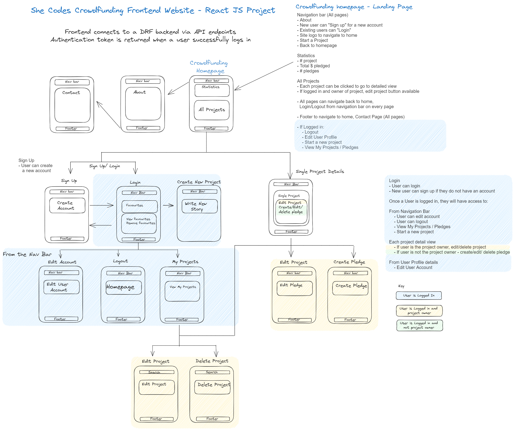
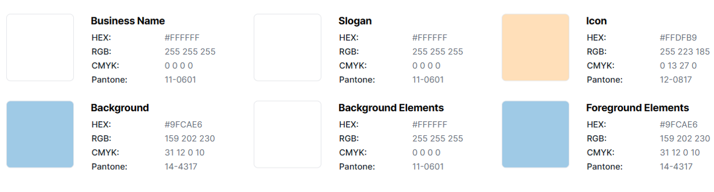
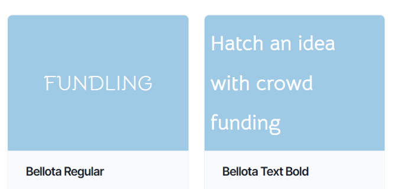

# Javascript React SheCodes Project - Fundling - Crowdfunding website
by Tracey Nguyen
- She Codes crowdfunding project - Javascript React Frontend.

## About
"Fundling" is a crowdfunding website to enable fundraising for things related to kids events. Think of school fairs, sporting events, volunteering, camps or excursions. The site enables kids to post about an event and get awareness for community support and fundraising.

## Submission Documentation

### Deployed Frontend React Project
* [https://fundling.netlify.app/](https://fundling.netlify.app/)

### Github Repository
* [https://github.com/trace-n/crowdfunding_front_end](https://github.com/trace-n/crowdfunding_front_end "Github repo")

## Features

### React JS - front end features include:

* [X] Be separated into two distinct projects: an API built using the Django RestFramework and a website built using React.
* [X] Have a  name, bonus points if it includes a pun and/or missing vowels. See https://namelix.com/ for inspiration.  
* [X] Have a clear target audience.

* [X] User can Login/Logout 
    - [X] Username
    - [X] Email
    - [X] Password
    - [X] Image

* [X] User can only change their own account profile details
            
* [X] User can create, edit, display a project
    - [X] Title
    - [X] Owner (a user)
    - [X] Description
    - [X] Image
    - [X] Target amount to fundraise
    - [X] Whether it is currently open to accepting new supporters or not 
    - [X] When the project was created (auto filled on initial creation)
    - [X] When the project was changed (auto filled on create/update)
    - [X] When the project ends (user defined)
    - [X] User can edit project if they are the owner of the project   
    - [X] User can view list of their own project 

* [X] User can make a Pledge
    - [X] An amount
    - [X] The project the pledge is for
    - [X] The supporter/user (i.e. who created the pledge)
    - [X] Whether the pledge is anonymous or not
    - [X] If the supporter is not the project owner, pledge can be created
        - [X] If the project is not currently open, pledge cannot be created               
    - [X] A comment to go along with the pledge
    - [X] User can edit pledge if the project is open and they are the supporter   
    - [X] User can delete pledge if the project is open and they are the supporter       
 
 * [X] Implement suitable permissions, e.g. who is allowed to delete a pledge?
 * [X] Return the relevant status codes for both successful and unsuccessful requests to the API.
 * [X] Handle failed requests gracefully (e.g. you should have a custom 404 page rather than the default error page).
* [X] Use Token Authentication.
* [X] Implement responsive design

### Stretch Goals

* [X] Display statistics on the home page # projects, pledges, $, unique supporters
* [] Add additional fields for projects
    - [] School Name
    - [] Website
    - [] Categories
* [] Search project based on categories or title/description
* [X] Percentage funded - display as graph
* [X] Days to go/ left for deadline
* [X] Last 5 donations displayed on detailed project page

## Wireframes

## Styling

### Colour Scheme
 

### Fonts

* Header fonts - Bellota Regular
* Body Fonts - Bellota Text
* Arial

## How To Run Locally

| Commands | Description |  
| :---: | :---: |  
| npm run dev | Run local instance for development |
| git   | Any changes will need to be made and pushed to git to update on netlify frontend site |

## Summary of project files
| Folder | File | Description |  
| :---: | :---: | :---: |  
| public | _redirects |  Helps with issue for page refresh on sub-routes not working correctly after deployment   | 
| src/ | * | Main working directory |
| src/api | * | This contains backend URL API endpoint  for GET/PUT/DEL/POST|
| src/assets | * | Images for project |
| src/components | * | React Components - Each component has a folder of the same name and an index.jsx and style.css file |
| src/hooks | * | Hooks for api calls |
| src/pages | * | Website pages for routes |
| src/ | main | Contains jsx and css file for routing paths to pages|
| base | index.html | Points to main.jsx file |
| base | README.md | Readme file for this repository |

## Reference

### Deployed Backend DRF+ Project
* [https://unicorn-rainbow-1618.fly.dev/projects/](https://unicorn-rainbow-1618.fly.dev/projects/ "Deployed backend")

### Github Repository for DRF+ Backend Crowdfunding project
* [https://github.com/trace-n/crowdfunding_back_end](https://github.com/trace-n/crowdfunding_back_end "Github crowdfunding back end")